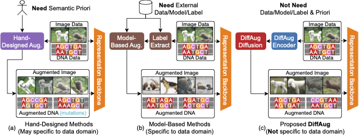
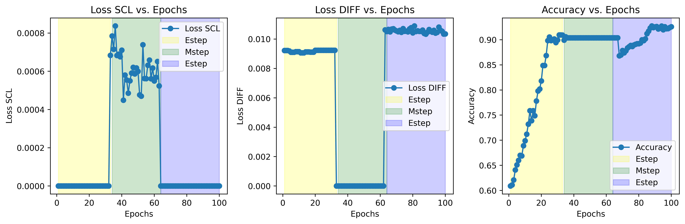

# DiffAug: Enhance Unsupervised Contrastive Learning with Domain-Knowledge-Free Diffusion-based Data Augmentation



Unsupervised Contrastive learning has gained prominence in fields such as vision, and biology, leveraging predefined positive/negative samples for representation learning. Data augmentation, categorized into hand-designed and model-based methods, has been identified as a crucial component for enhancing contrastive learning. However, hand-designed methods require human expertise in domain-specific data while sometimes distorting the meaning of the data. In contrast, generative model-based approaches usually require supervised or large-scale external data, which has become a bottleneck constraining model training in many domains. To address the problems presented above, this paper proposes DiffAug, a novel unsupervised contrastive learning technique with diffusion mode-based positive data generation. DiffAug consists of a semantic encoder and a conditional diffusion model; the conditional diffusion model generates new positive samples conditioned on the semantic encoding to serve the training of unsupervised contrast learning. With the help of iterative training of the semantic encoder and diffusion model, DiffAug improves the representation ability in an uninterrupted and unsupervised manner. Experimental evaluations show that DiffAug outperforms hand-designed and SOTA model-based augmentation methods on DNA sequence, visual, and bio-feature datasets.

Full paper can be downloaded via [arxiv](https://arxiv.org/abs/2309.07909).

## Configurating python environment

We recommend using conda for configuration. You can refer to our `envrionment.yml`.

## Run MuST

You can run MuST with a single line of code to get spatial clustering result and its latent embedding.

### Minimun replication

Running minimal replication can be done with the following command:

```bash
python ./main_diffaug.py fit --config=conf/gast.yaml
```

We use Gast(from 10x Visium) dataset for demonstration. On our 64-core A100 machine, it usually lasts about 4 minutes. Sample result is provided below:



### Multi platform support

For 10x Visium platform, datasets are downloaded and handled automatically. 
For Stereo-seq and SlideSeq platforms, check section `Data Description` in our paper to get data. 

We provided a universal standard to handle multi platform datasets. Some datasets need to be processed as one file and its path should be `data/<dataset>/data.h5ad`.

```bash
python ./main_diffaug.py fit --config=<dataset>.yaml
```

```bash
result
|-- conf
    |-- gast.yaml            # embedding
    |-- gast.yaml            # embedding
    |-- gast.yaml            # embedding
    |-- gast.yaml            # embedding
```


## Cite us

```bib
@misc{zang2023boosting,
      title={Boosting Unsupervised Contrastive Learning Using Diffusion-Based Data Augmentation From Scratch}, 
      author={Zelin Zang and Hao Luo and Kai Wang and Panpan Zhang and Fan Wang and Stan. Z Li and Yang You},
      year={2023},
      eprint={2309.07909},
      archivePrefix={arXiv},
      primaryClass={cs.LG}
}
```

